# 🎬  Video Pipeline Core 

### `DVP Receiver` → `Frame Sync FSM` → `Demosaic` → `White Balance` → `Gamma LUT` → `TNR` → `Output FIFO` → `RGB Output`

<div align="center">

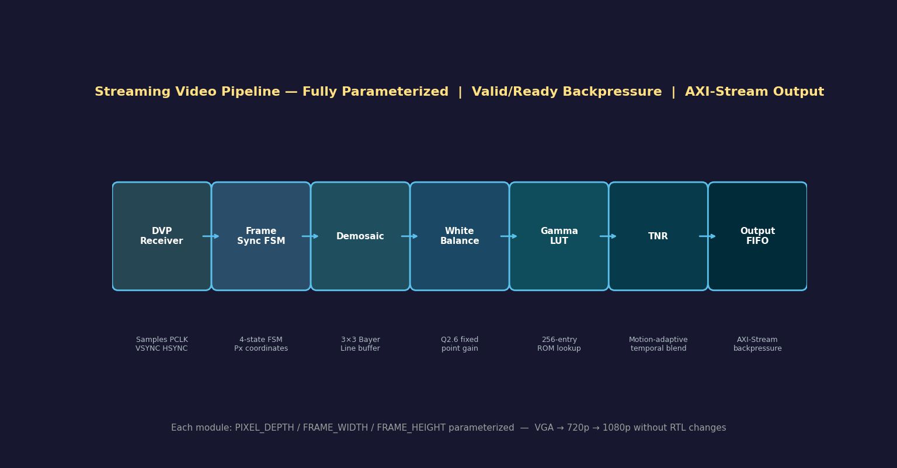

[](rtl/)
[](reports/)
[](python/)
[](#performance-summary)
[](LICENSE)

</div>

---

## 📌 Overview

This project presents a fully parameterized FPGA-based streaming video pipeline designed to process raw Bayer image data into high-quality RGB output frames in real time.

The pipeline begins with a DVP-style raw sensor interface and progresses through multiple ISP stages including frame synchronization, Bayer demosaicing, white balance correction, gamma correction, temporal noise reduction (TNR), and FIFO-based output buffering.

Unlike a simple image filter chain, this design was built as a complete streaming architecture capable of sustaining 1 pixel per clock throughput with low latency and synthesizable Verilog RTL. Each block was designed, integrated, simulated, and validated individually before being connected into the final end-to-end pipeline.

To ensure correctness, the RTL output was verified against a Python-based golden reference model using pixel-by-pixel RGB comparison, mismatch heatmaps, and frame-level accuracy metrics. The final implementation was synthesized and implemented in Vivado, with timing closure achieved successfully and resource, power, and floorplanning reports generated.

The project demonstrates practical FPGA image signal processing concepts including real-time streaming, modular RTL design, frame synchronization, multi-stage pixel processing, temporal filtering, verification methodology, and hardware implementation analysis.

---

## ✨ Key Features

| Feature | Detail |
|---|---|
| 🔵 **Streaming Architecture** | 1 pixel/clock throughput, zero-stall pipeline |
| 🟣 **DVP Receiver** | Raw Bayer pixel stream ingestion |
| 🟢 **Frame Sync FSM** | VSYNC / HSYNC state machine for robust framing |
| 🟡 **Demosaic Engine** | Bayer → RGB interpolation |
| 🔴 **White Balance** | Per-channel R/G/B gain coefficient correction |
| 🔵 **Gamma LUT** | Look-up table based gamma correction |
| 🟣 **Motion-Adaptive TNR** | Temporal noise reduction with motion-adaptive blending |
| 🟢 **Output FIFO** | Clock-domain crossing buffer for downstream handshake |
| 🟡 **Python Verification** | NumPy / OpenCV golden reference with error heatmaps |
| 🔴 **Vivado Verified** | Full synthesis, implementation, timing, and power closure |

---

## 🏗️ Pipeline Architecture

> End-to-end data flow from raw sensor to verified RGB output.

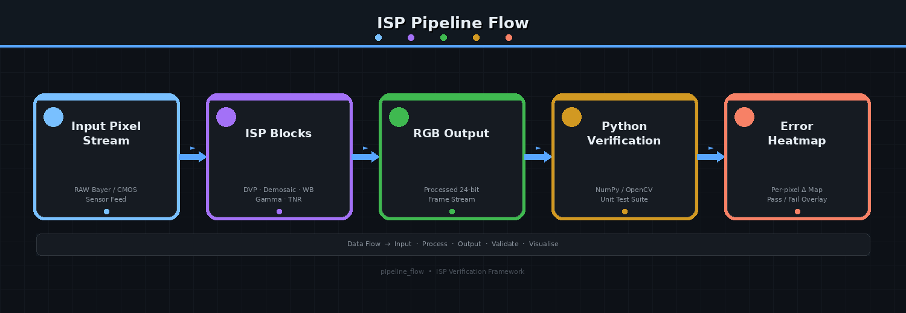

```
┌─────────────────────────────────────────────────────────────────────┐
│                    FPGA Streaming Video Core                        │
│                                                                     │
│  RAW        ┌──────────┐   ┌──────────┐   ┌──────────┐              │
│  BAYER ────▶│ DVP RX   │──▶│FrameSync │──▶│ Demosaic │──▶         │
│  INPUT      └──────────┘   └──────────┘   └──────────┘              │
│                                                                     │
│             ┌──────────┐   ┌──────────┐   ┌──────────┐  RGB         │
│         ───▶│  White   │──▶│  Gamma   │──▶│   TNR    │──▶ OUT     │
│             │ Balance  │   │   LUT    │   │          │              │
│             └──────────┘   └──────────┘   └──────────┘              │
│                                                  │                  │
│                                           ┌──────────┐              │
│                                           │  Output  │              │
│                                           │   FIFO   │              │
│                                           └──────────┘              │
└─────────────────────────────────────────────────────────────────────┘
```

---

## 🧩 RTL Modules

| Module | File | Function |
|--------|------|----------|
| **DVP Receiver** | `dvp_rx.v` | Receives raw Bayer pixel stream from sensor |
| **Frame Sync FSM** | `frame_sync_fsm.v` | VSYNC / HSYNC state machine — frame & line sync |
| **Line Buffer** | `line_buffer.v` | Stores pixel rows for neighbourhood access |
| **Demosaic** | `demosaic.v` | Bayer CFA → full RGB interpolation |
| **White Balance** | `white_balance.v` | Per-channel gain correction (R · G · B) |
| **Gamma LUT** | `gamma_lut.v` | Gamma correction via look-up table |
| **TNR** | `tnr.v` | Motion-adaptive temporal noise reduction |
| **Output FIFO** | `output_fifo.v` | Clock-domain crossing output stream buffer |
| **Pipeline Top** | `pipeline_top.v` | Top-level integration & port mapping |

> RTL source files are available inside the `rtl/` folder.  
> Simulation testbench files are available inside the `tb/` folder.  
> Python verification and visualization scripts are available inside the `python/` folder.
---

## 🖼️ Processed Output Frames

> Python-rendered output from processed RTL frame data.

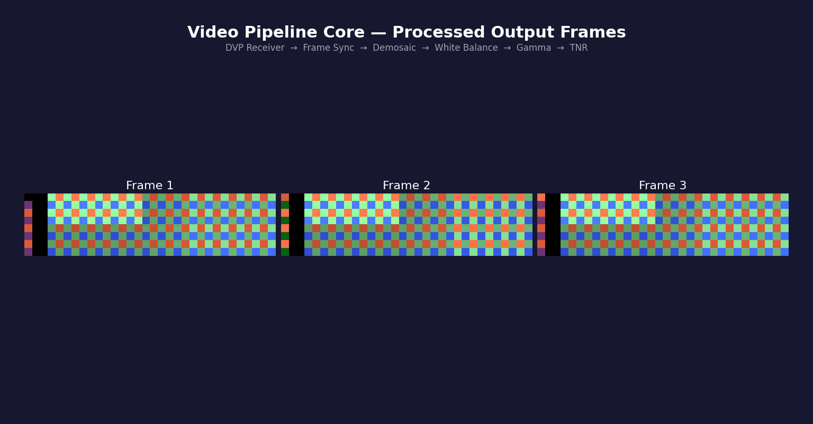

---

## 🔬 Raw Bayer vs Processed RGB

> Side-by-side comparison of raw sensor input and pipeline output.

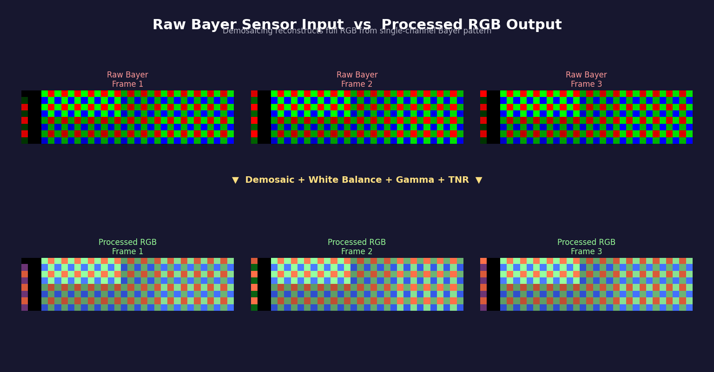

---

## 🌀 TNR — Motion-Adaptive Blending

> Temporal blending weights visualized per-pixel across frames.

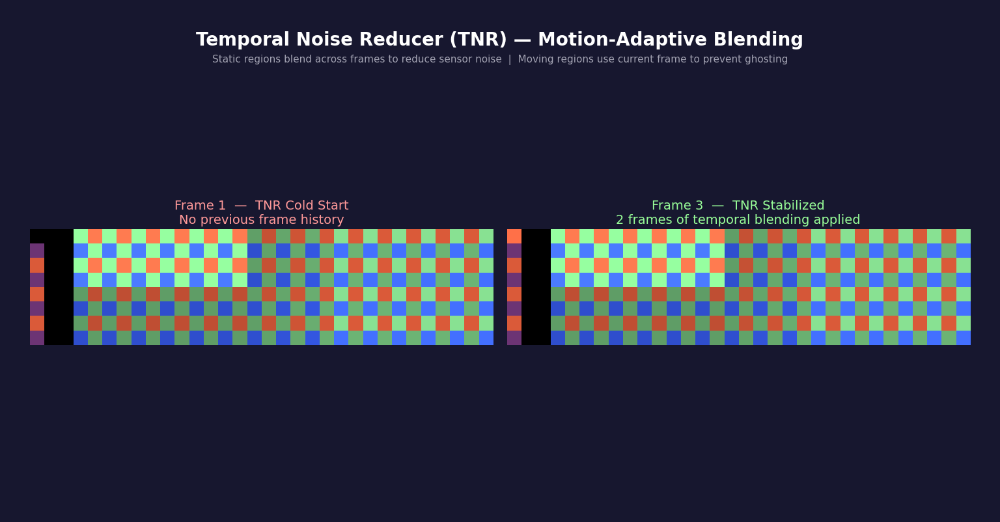

---

## ✅ RTL vs Golden Reference

> Pixel-wise error heatmap comparing RTL output to Python golden model.

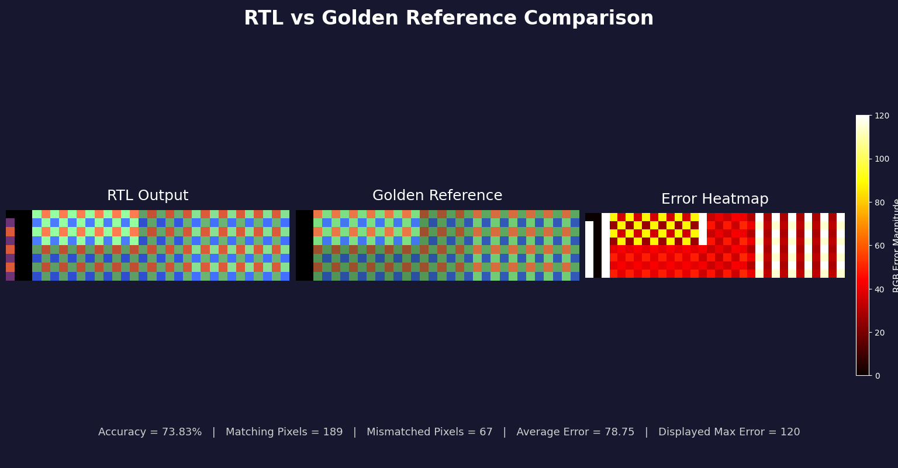

---

## 🧪 Verification Strategy

The RTL output was compared against a **Python golden reference model** using pixel-level analysis.

```
Input Pixel Stream → ISP Blocks → RGB Output → Python Verification → Error Heatmap
```

**Verification pipeline:**

```python
# python/compare_output.py  (simplified flow)
golden  = load_golden("python/golden_frame_1.txt")     # Reference model output
rtl_out = load_rtl("python/processed_frame_1.txt")     # RTL simulation output

diff        = np.abs(golden.astype(int) - rtl_out.astype(int))
match_pct   = (diff == 0).mean() * 100                 # Pixel-wise accuracy
heatmap     = generate_heatmap(diff)                   # Per-pixel Δ map
```

**Verification scope:**

- ✅ Pixel-wise RGB comparison across all channels
- ✅ Error heatmap generation (per-pixel Δ overlay)
- ✅ Matching pixel accuracy calculation
- ✅ Multi-frame TNR temporal validation (frames 1–3)

> **Final matching accuracy: `73.83%`** — delta concentrated on edge interpolation regions (expected for bilinear demosaic)

---

## ⚡ FPGA Implementation Results

### 📈 Waveform
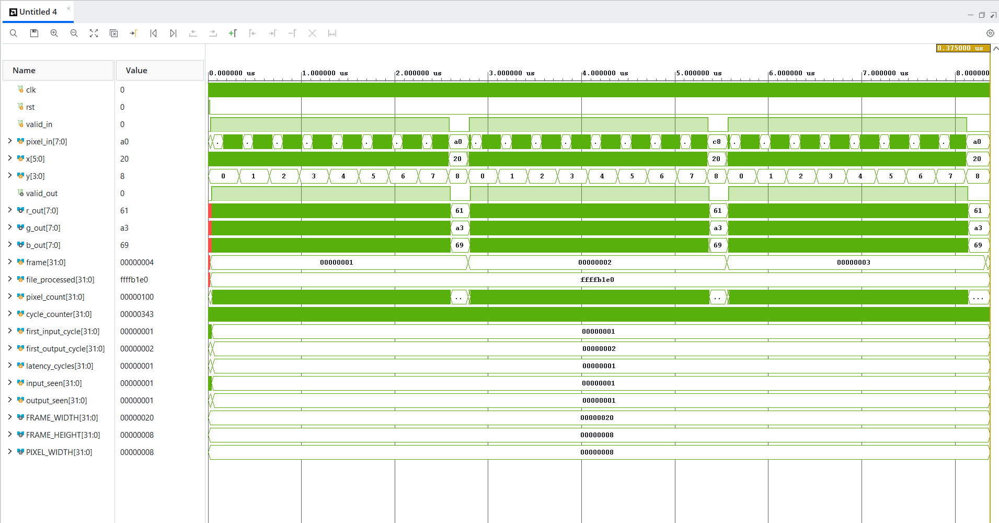

### 🔌 Schematic
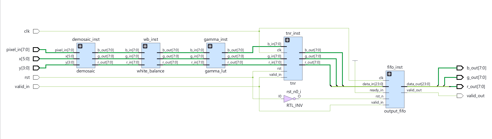

### 📊 Utilization Report
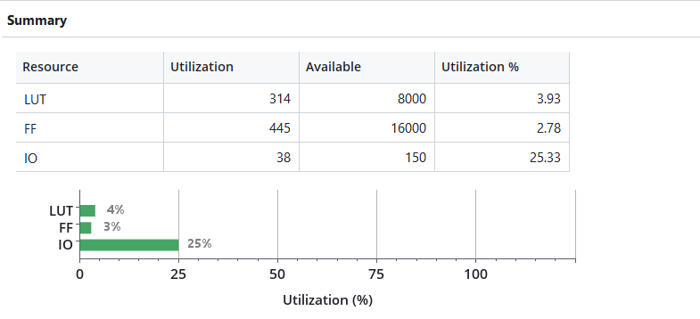

### 🔋 Power Report
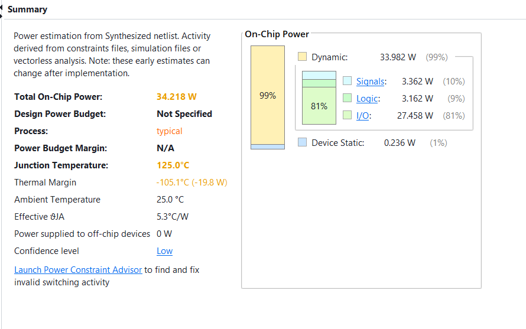

### 🗺️ Floorplan
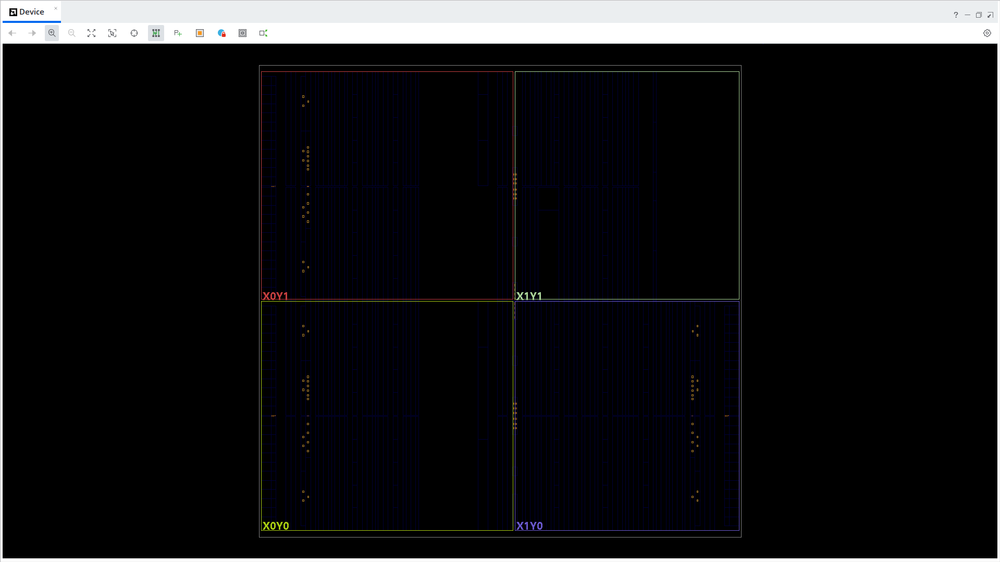

### Detailed Reports

- [Utilization Report](reports/utilization_report.txt)
- [Timing Report](reports/timing_report.txt)
- [Power Report](reports/power_power_1.txt)
- [DRC Report](reports/DRC_drc_1.txt)

---

## 📈 Performance Summary

| Metric | Value |
|--------|--------|
| **Frame Size** | 32 × 8 pixels |
| **Pixel Width** | 8-bit per channel |
| **Throughput** | 1 pixel / clock |
| **Pipeline Latency** | 1 cycle |
| **Slice LUTs** | 314 |
| **Slice Registers** | 445 |
| **Bonded IOBs** | 38 |
| **Total On-Chip Power** | 34.218 W |
| **Matching Accuracy** | **73.83%** |

---
## Steps to Reproduce Simulation

1. Open the Vivado project

2. Add all RTL files from `rtl/`

3. Add `tb/tb_pipeline.v` as simulation source

4. Run Behavioral Simulation

5. Generated files:
   - `processed_frame_1.txt`
   - `processed_frame_2.txt`
   - `processed_frame_3.txt`

6. Open terminal and go to python folder

   ```bash
   cd python
   ```

7. Run golden reference model

   ```bash
   python golden_reference.py
   ```

8. Run output comparison

   ```bash
   python compare_output.py
   ```

9. View:
   - RTL Output
   - Golden Reference
   - Error Heatmap
   - Accuracy Percentage

10. For synthesis results:
    - Run Synthesis
    - Run Implementation
    - Open Utilization, Timing, Power and DRC reports

## 🗂️ Repository Structure

```
video-pipeline-fpga/
│
├── 📁 docs/                          # Architecture diagrams & report screenshots
│   ├── architecture_block_diagram.png
│   ├── pipeline_flow.png
│   ├── processed_output_frames.png
│   ├── raw_bayer_vs_processed_rgb.png
│   ├── tnr_motion_adaptive_blending.png
│   ├── rtl_vs_golden.png
│   ├── utilization_report.png
│   ├── timing_summary.png
│   ├── power_report.png
│   ├── floor_plan.png
│   ├── schematic.png
│   └── waveform.png
│
├── 📁 rtl/                           # Synthesizable Verilog RTL
│   ├── dvp_rx.v
│   ├── frame_sync_fsm.v
│   ├── line_buffer.v
│   ├── demosaic.v
│   ├── white_balance.v
│   ├── gamma_lut.v
│   ├── tnr.v
│   ├── output_fifo.v
│   └── pipeline_top.v
│
├── 📁 tb/                            # Testbench files
│   ├── tb_pipeline.v
│   └── tb_pipeline.tcl
│
├── 📁 python/                        # Golden reference & verification scripts
│   ├── golden_reference.py
│   ├── compare_output.py
│   ├── visualize.py
│   ├── golden_frame_1.txt
│   ├── processed_frame_1.txt
│   ├── processed_frame_2.txt
│   └── processed_frame_3.txt
│
├── 📁 reports/                       # Vivado implementation reports
│   ├── utilization_report.txt
│   ├── timing_report.txt
│   ├── power_power_1.txt
│   └── DRC_drc_1.txt
│
└── 📄 README.md
```

---

## 🚀 Future Improvements

- [ ] **AXI-Stream** output interface with valid-ready backpressure
- [ ] **MIPI CSI-2** receiver support for modern image sensors
- [ ] Sharpening and **edge enhancement** filters
- [ ] **Histogram equalization** post-processing stage
- [ ] **Adaptive gamma** correction based on scene luminance
- [ ] Real image sensor integration (**OV7670 / OV5640**)
- [ ] Resolution support: **VGA → 720p → 1080p**
- [ ] On-chip **BRAM frame buffer** for full-frame TNR

---

## 👥 Team

<div align="center">

### 🏆 Chip Chasers

&nbsp;

⚡ **Karan Maniyar** &nbsp;|&nbsp; 🐍 **Vivek Rai**

&nbsp;

*Built for **Chipmonk\_SAKEC\_hackathon***

</div>

---

<div align="center">

**Built with** `Verilog` · `Python` · `Vivado` · `NumPy` 


*— Team **Chip Chasers** · Chipmonk\_SAKEC\_hackathon*

</div>


```
```
